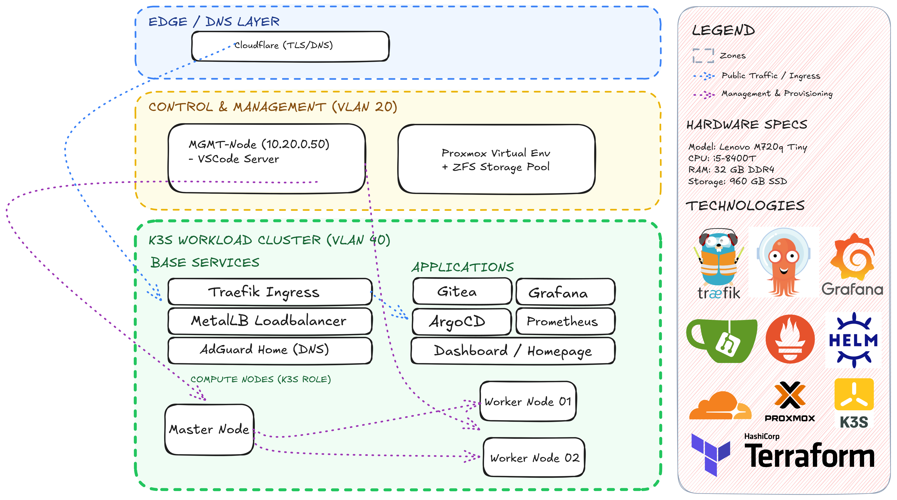

# 💶 EuroOpenCost — Your Sovereign Cloud, Zero Waste.

<p align="center">
    <picture>
        <source media="(prefers-color-scheme: light)" srcset="logo.svg">
        
    </picture>
</p>

<p align="center">
  <strong>STOP OVERPAYING. START DEPLOYING.</strong>
</p>

<p align="center">
  <a href="#"></a>
  <a href="#"></a>
  <a href="#"></a>
  <a href="LICENSE"></a>
</p>

EuroOpenCost is the ultimate Sovereign Framework for developers and entrepreneurs who want to master their infrastructure.

Stop wasting your hardware's potential. We leverage Proxmox, K3s, and GitOps to transform your homelab into a professional-grade development environment. While others struggle with complex cloud configurations and unpredictable bills, you run a production-ready cluster on your own terms—optimized for speed, cost, and absolute control.


[Website](https://salad1n.dev) · [Infrastructure](#-1-infrastructure-blueprint--technical-architecture) · [Manual Steps](#-2-pre-flight-checklist-manual-steps) · [Networking](#3-networking-route-vlan-40) · [Vision](#4--The-Vision-of-EuroOpenCost-Lab) · [Sponsors](#5-sponsors--partners)

---


>
> ### 💡 The Founder's Deep Dive
>  
>
>
>
> "Beyond the Cloud: Why your Homelab is the ultimate Dev-Tool."
> Modern software development shouldn't be limited by cloud latency or costs. 
> EuroOpenCost turns your hardware into a high-performance lab. Read the full technical deep-dive on my blog.
>
>
> [**Read my blog artictle**](https://salad1n.dev/posts/euroopencost-lab)**.**
>
>

## 🏛 1. Infrastructure Blueprint & Technical Architecture


True sovereignty is built on a foundation of physical control and logical isolation. The EuroOpenCost-Lab is a battle-tested architecture designed for high availability and strict network separation (SDN).

### 1.1 Infrastructure Diagramm


<p align="center">
  
</p>

Made with love.


---


### 1.2 The Technical Stack


* **Hypervisor (The Foundation):** [Proxmox VE](https://www.proxmox.com) running on Lenovo M720q Tiny (i5-8400T, 32GB RAM, 960GB SSD). Proxmox provides the stability and virtualization layers needed for multi-tenant dev environments.


* **Network Isolation (SDN & VLANs):** Orchestrated networking using Proxmox SDN to separate Management (VLAN 20) and Production/Workload (VLAN 40) traffic.


* **Dynamic DNS & SSL:** [Cloudflare](https://cloudflare.com) DNS-01 Challenge integration for seamless Wildcard-SSL (`*.salad1n.dev`) rotation without exposing internal ports.


* **Orchestration:** [K3s](https://k3s.io) (Lightweight Kubernetes). A minimal yet fully-compliant K8s distribution optimized for edge and lab environments.


* **Edge Routing:** [Traefik](https://traefik.io) as the primary Ingress Controller, coupled with **MetalLB** for local LoadBalancer IP assignments.


* **GitOps Core:** [ArgoCD](https://argoproj.github.io/cd/) — The single source of truth. Your cluster maintains its state automatically based on your Git repository.


## 🛠 2. Step by Step Deployment Guide

*Before firing up the automated deployment scripts, you need to manually bridge the gap between your hardware and the outside world.*

---
### 2.1 Proxmox Setup
1. **Create User:** Create a user named `terraform-prov@pve` in your Proxmox web interface.
2. **Permissions:** Assign the `PVEVMAdmin` and `PVEDatastoreAdmin` roles to this user.
3. **API Token:** Generate an API Token for this user. **Save the Secret Key!** You will need it for your Terraform variables.

### 2.1 Infrastructure Provisioning
1. **Clone the Repo:**
   ```bash
   git clone https://github.com/euroopencost/euroopencost-lab.git
   cd euroopencost-lab

### 2.1.1 Cloudflare API Token
* You require a token with **Zone:DNS:Edit** and **Zone:Zone:Read** permissions.
* Create the token in your Cloudflare Dashboard.
* You will insert this into your `globals.yaml` later in the guide.

### 2.2 K3s Kubeconfig Export
To control your cluster from your management machine, you must migrate the config from the Master node after deployment:
1. **SSH to Master:** `ssh ubuntu@your-k8s-master-ip`
2. **Read Config:** `sudo cat /etc/rancher/k3s/k3s.yaml`
3. **Save Locally:** Copy the content to your MGMT host at `~/.kube/config`.
4. **Update IP:** Replace `server: https://127.0.0.1:6443` with `server: https://your-k8s-master-ip:6443`.


### 2.3 Infrastructure Provisioning (Terraform)

This stage handles the automated creation of your Virtual Machines on Proxmox.

1.  **Configure Variables:**
    Navigate to the `terraform/` directory and locate the `terraform.tfvars` file. Even though it contains dummy values for the repository, you must update it with your specific environment data:
    *   `proxmox_api_url`: Your Proxmox endpoint (e.g., `https://192.168.1.10:8006/api2/json`).
    *   `proxmox_api_token_id`: The ID of the token created in the Proxmox Setup step.
    *   `proxmox_api_token_secret`: The secret key for your automation user.
    *   `network_config`: Define your IP addresses and gateways for VLAN 20 and 40.

2.  **Initialize and Deploy:**
    Run the following commands to initialize the providers and roll out the infrastructure:
    ```bash
    cd terraform
    terraform init
    terraform plan   # Review the changes before applying
    terraform apply -auto-approve
    ```

3.  **Capture SSH Output:**
    Once the deployment is successful, Terraform will display a custom output named `master_ssh_command`. 
    *   **Action:** Copy this command immediately.
    *   **Purpose:** Use it to verify that your Master Node is reachable before proceeding to the Helm/K3s deployment.


Ensure your Proxmox node has enough resources (CPU/RAM) available as defined in your `hardware_specs` within the Terraform files to avoid provisioning errors.


## 3. Networking Route (VLAN 40)
Sollte dein Management-Host in einem anderen Netz (z.B. Home-Office LAN `192.168.2.0/24`) hängen, setze die Route zum Proxmox-SDN:


If your MGMT host resides in a different network (e.g., standard LAN IP-ADRESS/24), add a route to the Proxmox SDN:

````bash
sudo ip route add IP-ADRESS/24 via <YOUR_PROXMOX_NODE_IP>
````

#### Configure your secret sauce

After your Terraform deployment is finished, you need to sync the infrastructure variables to your lab configuration. 

Run the sync script to generate a fresh globals.yaml based on your terraform.tfvars.

#### Sync Terraform outputs to globals.yaml
````bash
bash sync-globals.sh
````

#### IMPORTANT: Manually add your sensitive tokens (e.g., Cloudflare)
````shell
nano globals.yaml 
````

The sync script automatically extracts your domain, IP addresses, and node names to ensure out-of-the-box compatibility, but sensitive secrets like the Cloudflare Token must be pasted manually for security reasons.

#### Ignite the Lab
````shell
bash deploy-lab.sh
````


## 4. 🎯 The Vision of EuroOpenCost Lab

The EuroOpenCost-Lab was born from the need to merge agility with total resource control.

**Software First**: We build infrastructure that serves the software, not the other way around. No overhead, just pure performance for your apps.

**Zero Waste (Resource Sovereignty)**: We utilize every CPU cycle. Why pay for idle "On-Demand" instances when you have dedicated silicon at home?

**Local Speed, Global Reach**: Develop with sub-millisecond latency locally, then expose your apps globally using secure Cloudflare tunnels or Ingress.

**Empowered Ownership**: In a world of rented subscriptions, owning your infrastructure is the ultimate act of technical freedom.


## 5.🤝 Sponsors & Partners